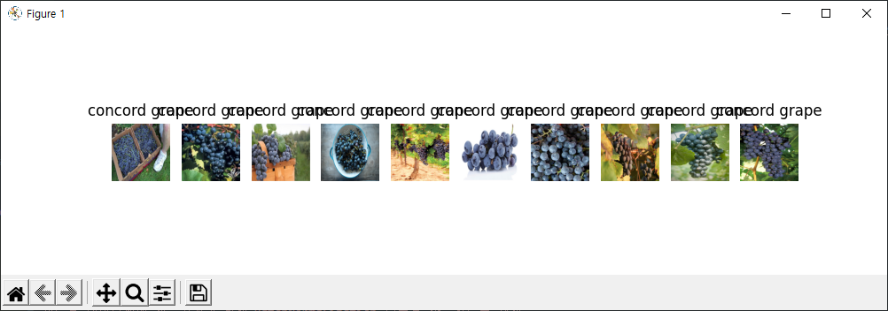
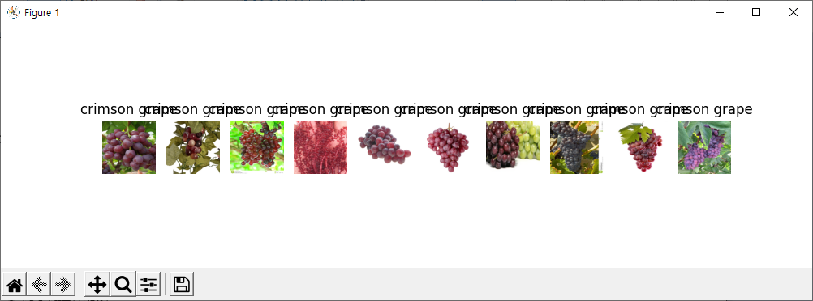
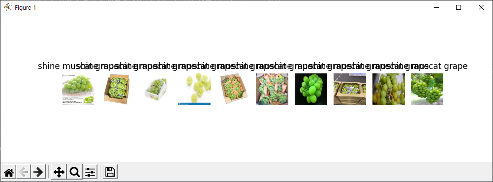
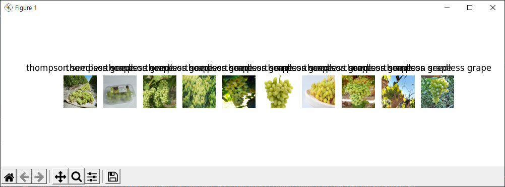
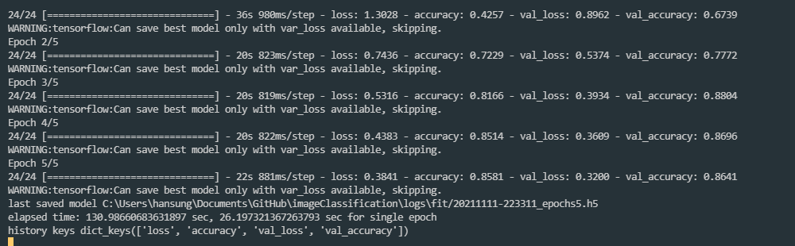

# ImageClassification

- Desgined by David Park
- No License
- Contact: rjtp5670@gmail.com

This is my personal AI project to take a bite of AI world. Honestly, I have no background knowledge about AI (And have lack of programming experience, not gonna lie). So that most of codes are not written from scratch and by myself. Thanks to my tutor, Junhee, he helps me a lot to work around, but also Tensorflow Tutorial & references with Google search.

I has done my best adding very detailed explanation based on my noob experience, so that hope this help someone to understand the difficult AI world.

## Operating Enviroment

- Windows 10
- Visual Studio Code
- TensorFlow v2.6 (GPU used, Nvidia Geforce 1050)
- Python v3.8.8 (Setup using Anaconda)

### TensorFlow Installation (GPU Setup)

- TensorFlow v2.6 (GPU used, Nvidia Geforce 1050)

### Dataset Load

Concord Grape, Crimson Grape, Shine Msucat Grape, Thompson Seedless Grape are classes.

`Download`: [Grape Data Set](https://drive.google.com/file/d/1hrMcXlr-kjzr0QF7QZcmMrBv16tyCqEI/view?usp=sharing)



> Concord Grapes

<br>



> Crimson Grape

<br>



> Shine Msucat Grape

<br>



> Thompson Seedless Grape

### Preprocessing - ImageDataGenerator

Keras provides Image Augumentation generator that increases dataset training.

<!--  Augumentation을 위한 객체 생성 ImageDataGenerator -->

To generate batches of tensor images datas for data argumentaion, firstly, create an object from `ImageDataGenerator` .

```python
datagen_train = ImageDataGenerator(
    preprocessing_function=preprocess_input,  # Preprocessing
    rotation_range=10,  # Loop within specified ranges
    zoom_range=0.1,  # Zoom images
    width_shift_range=0.1,  # Shift image
    height_shift_range=0.1,  #
    horizontal_flip=True,  # Flip Image
    vertical_flip=True,  #
    validation_split=0.2  # Use 20% images for a validation.
)

```

Use `flow_from_directory` method from `datagen_train` to augument data (Data from `trainingset_dir`).

Generally, separating dataset into data for training (`train_generator`) and validation (`validation_generator`)

See more details on `flow_from_directory` at [Image data processing](https://keras.io/ko/preprocessing/image/)

<!-- 이미지 변형 -->

```python
train_generator = datagen_train.flow_from_directory(
    trainingset_dir,
    subset='training',
    target_size=(W, H),
    class_mode='categorical',
    batch_size=batch_size,
    seed=seed
)

validation_generator = datagen_train.flow_from_directory(
    trainingset_dir,
    subset='validation',
    shuffle=False,
    target_size=(W, H), class_mode="categorical", batch_size=batch_size, seed=seed
)

```

### Build Model

Bring pretraind model features from [Imagenet](https://www.tensorflow.org/api_docs/python/tf/keras/applications/resnet50/ResNet50)

To improve the training time and efficiendy, perform BatchNormalization.

```python
def build_model(units):

    resnet = ResNet50(
        include_top=False,
        pooling="avg",
        weights="imagenet"
    )
    for layer in resnet.layers[:-10]:
        layer.trainable = False or isinstance(layer, BatchNormalization)

    logits = Dense(units)(resnet.layers[-1].output)
    output = Activation('softmax')(logits)

    model = Model(resnet.input, output)
    optimizer = keras.optimizers.Adam(learning_rate=learning_rate)

    model.compile(optimizer=optimizer,
                  loss='categorical_crossentropy', metrics=['accuracy'])
    return model
```

#### Transfer Learning

When you have limited datasets, you can bring predefined training network and apply the trained feature from [`ResNet50`](https://www.tensorflow.org/api_docs/python/tf/keras/applications/resnet50/ResNet50).

### Training

Load a model to train using `fit` method.

```python
history = model.fit(
    train_generator,  #
    validation_data=validation_generator,
    epochs=epochs,
    callbacks=[tensorboard_callback,
                # early_stopping,
                model_checkpoint_callback]
)

units = len(class_names)
model = build_model(units=units)

```


<!-- 
```
2021-11-21 20:10:26.236503: I tensorflow/compiler/mlir/mlir_graph_optimization_pass.cc:185] None of the MLIR Optimization Passes are enabled (registered 2)
Epoch 1/5
2021-11-21 20:10:31.548776: I tensorflow/stream_executor/cuda/cuda_dnn.cc:369] Loaded cuDNN version 8202
 1/24 [>.............................] - ETA: 4:42 - loss: 1.2435 - accuracy: 0.36362021-11-21 20:10:38.680358: I tensorflow/core/profiler/lib/profiler_session.cc:131] Profiler session initializing.
 2/24 [=>............................] - ETA: 54s - loss: 1.4388 - accuracy: 0.3488
24/24 [==============================] - 38s 1s/step - loss: 1.2396 - accuracy: 0.4806 - val_loss: 0.9042 - val_accuracy: 0.6196
WARNING:tensorflow:Can save best model only with var_loss available, skipping.
Epoch 2/5
24/24 [==============================] - 21s 873ms/step - loss: 0.7329 - accuracy: 0.7202 - val_loss: 0.6404 - val_accuracy: 0.7554
WARNING:tensorflow:Can save best model only with var_loss available, skipping.
Epoch 3/5
24/24 [==============================] - 22s 890ms/step - loss: 0.5439 - accuracy: 0.7992 - val_loss: 0.4062 - val_accuracy: 0.8533
WARNING:tensorflow:Can save best model only with var_loss available, skipping.
Epoch 4/5
24/24 [==============================] - 21s 837ms/step - loss: 0.4419 - accuracy: 0.8380 - val_loss: 0.4036 - val_accuracy: 0.8696
WARNING:tensorflow:Can save best model only with var_loss available, skipping.
Epoch 5/5
24/24 [==============================] - 21s 878ms/step - loss: 0.3751 - accuracy: 0.8835 - val_loss: 0.3900 - val_accuracy: 0.8696
WARNING:tensorflow:Can save best model only with var_loss available, skipping.
last saved model C:\Users\hansung\Documents\GitHub\imageClassification\logs\fit/20211121-201025_epochs5.h5
elapsed time: 136.29585313796997 sec, 27.259170627593996 sec for single epoch
history keys dict_keys(['loss', 'accuracy', 'val_loss', 'val_accuracy'])
```
 -->


- Trained model's return value: history keys dict_keys(['loss', 'accuracy', 'val_loss', 'val_accuracy'])

### Confusion Matrix

Generate a predict matrix where each cell shows the counts value of training result. Therefore, you can visually see the built model performance.

```python
def show_confusion_matrix(model, validation_generator):
    validation_generator.reset()
    y_preds = model.predict(validation_generator)
    y_preds = np.argmax(y_preds, axis=1)
    y_trues = validation_generator.classes
    cm = confusion_matrix(y_trues, y_preds)

    fig, ax = plt.subplots(figsize=(7, 6))  # 700 x 600 px

    # Adding up with "True"
    # Apply color bar on heatmap
    sns.heatmap(cm, annot=True, fmt='d', cmap='Blues',
                cbar_kws={'shrink': .3}, linewidths=.1, ax=ax)

    ax.set(
        xticklabels=list(label_to_class.keys()),  # X-Axis label: Prediction
        yticklabels=list(label_to_class.keys()),  # Y-Axis label: True
        title='confusion matrix',
        ylabel='True label',
        xlabel='Predicted label'
    )

    params = dict(rotation=45, ha='center', rotation_mode='anchor')

    plt.setp(ax.get_yticklabels(), **params)
    plt.setp(ax.get_xticklabels(), **params)
    plt.show()


# Display Confusion Matrix.
show_confusion_matrix(model, validation_generator)

```

```
[[37  7  0  0]
 [ 4 53  0  0]
 [ 0  0 44  1]
 [ 3  0  4 31]]
```

> Confusion Matrix: The more accuracy the classifier can get, the more deeper blue it is.


> Add colorvar using a heatmap

### Performing the trained model

Classify the type of grape into the right class according to the trained model justification. A test image is a thompson grape. (\input_img\thompson_test_03.jpg)

```python

Grapes = r'C:\Users\hansung\Documents\GitHub\imageClassification\grape-dataset' # Doesn't have to be a path.
class_names = list(sorted(os.listdir(Grapes)))

# Dictionary Comprehenstion
class_to_label = dict([(i, class_name)
                      for i, class_name in enumerate(class_names)])

# Convert image to numpy array(4D array)
def load(filename):
    np_image = Image.open(filename)
    np_image = np.array(np_image).astype('float32')  #
    np_image = transform.resize(np_image, (224, 224, 3))
    np_image = np.expand_dims(np_image, axis=0)
    return np_image

# Test Image Path. Can be any images
filename = r'C:\Users\hansung\Documents\GitHub\imageClassification\input_img\thompson_test_03.jpg'
model = r'C:\Users\hansung\Documents\GitHub\imageClassification\logs\fit\20211106-221532_epochs5.h5'
# Load model .h5 file
model = tf.keras.models.load_model(model)

image = load(filename)  #

image = preprocess_input(image)
y_pred = model(image)[0]
print(y_pred)
cls = np.argmax(y_pred)
print(f'{class_to_label[cls]}: {(y_pred[cls]*100):.1f}%')
print([f'{label}: {(pred*100):.1f}' for label,
      pred in zip(class_to_label.values(), y_pred)])
pred_img = Image.open(filename).resize((256, 256))
pred_img.show()
```

#### Result

1. Concord Grape - 99.6%


2. Shine Muscat - 73.7%


3. Thompson Seedless- 68.5%


4. Chrimson Grape - 99.8%


